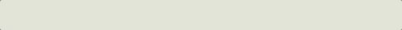
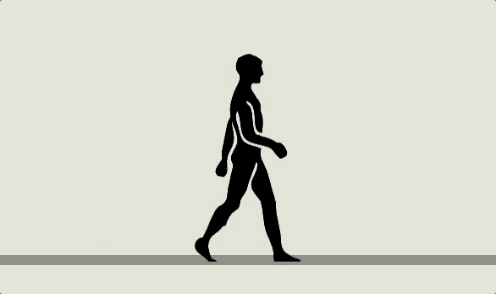
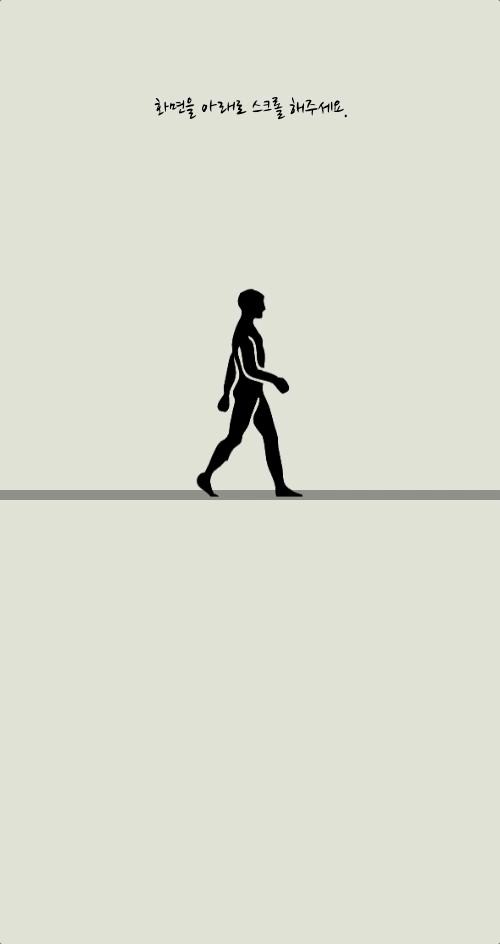

## **🌏 목적**

\- 화가인 지인분의 전시회 홍보 및 미리보기를 할 수 있는 웹 제작

 

## **⚡️ 기능**

\- 전시회 기본 정보 제공

\- 인터렉티브한 웹을 통한 전시회 간접 체험

\- 웹 및 모바일 접근성 고려한 반응형 웹

 

## **🛠 기술**

\- HTML, SCSS, Javascript

\- SVG를 활용한 드로잉 스크롤

 

## **🐛 마주쳤던 문제들**

#### **1) 모바일 환경 수평 스크롤**

모바일 상 터치를통해 수직 스크롤 시 수평으로도 움직이며 원만한 스크롤을 방해  
→ html, body에 max-width: 100%와 overflow-x: hidden을 주어 해결

#### **2) 이미지 컨테이너 안에 이미지들의 height값 늘어나는 문제**

반응형을 위해 이미지 고정값을 주지 않고, container안에 새로운 element가 들어가서 높이값을 줄 경우 이미지의 높이 값도 그에 따라 변경되는 문제

→ height값을 반응형으로 명시 후 max-height값 조절

#### **3) 스크롤바 제거**

SVG드로잉 스크롤이 있으며, 또한 스크롤바를 제공하지 않아도 된다 판단하여 제거  
\- body { -ms-overflow-style:none; }, ::-webkit-scrollbar { display: none; }

#### **4) 뚝뚝 끊기는 이미지**

사람이 우측으로 움직이는 모션을 할 경우 이미지컨테이너들이 px단위로 좌측 이동을 하는데 이 때 끊어지며 움직여 부드럽게 하고자함.  
\- requestAnimationFrame을 통한 loop 사용

#### **5) 기타**  
스크롤 값 하나로 대부분의 애니메이션 등이 작동되는데 이 때 각 애니메이션이 상호작용을 통해 처리되야하는 부분이 많았음.  
개인적인 욕심으로 기능을 계속 추가하다보니 복잡성이 매우 증가하여 코드 구현에 있어 다소 시간이 많이 투자되었음..

 

## **🕹 시연**

#### **SVG 드로잉 스크롤**

스크롤 값 백분율을 통한 스크롤바 대체 및 드로잉

 

#### **이미지 및 모션**

사람은 5개의 이미지를 통해 순환시켜 끊기는 문제에 대해 불가피하나, 이미지 컨테이너는 requestAnimationFrame을 통해

최대한 부드럽게 진행 (**gif 촬영 시 스크롤을 버벅 거리며해서 착시가 있으니 주의 바랍니다..**)

 

#### **전체**

